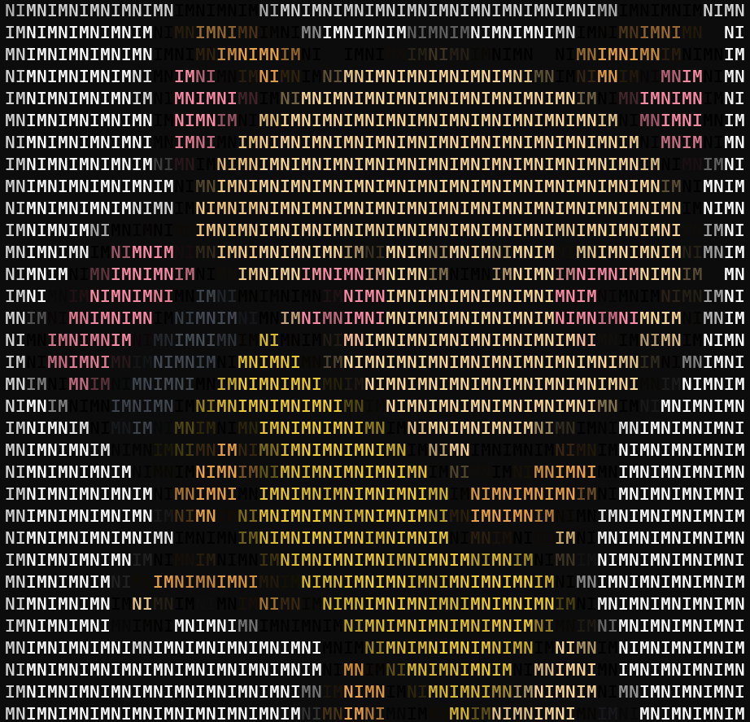

<p align="center">
  
</p>

<h2 align="center"><b>imgcat</b></h2>

<p align="center">
  <b>This utility prints pictures in your console
  <br/>
  </b>
  

   

   
</p>
<br>

# Usage
To print an image write:
```bash
$ imgcat <IMAGENAME>
```
To get help write:
```
$ imgcat --help
```

# Utils

You can also use imgcat as a Nim library:
```nim
import imgcat

echo imgcat("imagename.png",
            pattern="NIM",
            width=100,
            height=100,
            black_and_white=false)

```
# Gallery




<p align="center">Icon made by <a href="http://www.freepik.com/" title="Freepik">Freepik</a> from <a href="https://www.flaticon.com/" title="Flaticon">www.flaticon.com</a></p>
